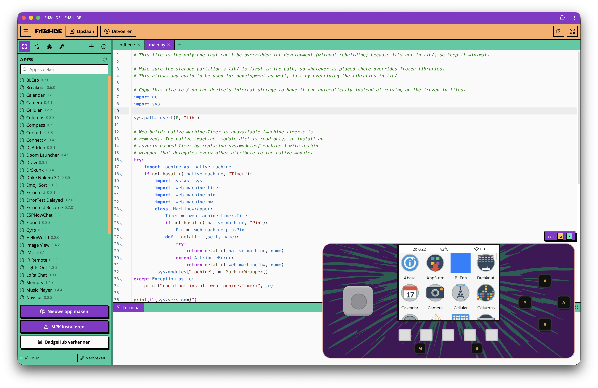

# Fri3d-IDE

[](https://github.com/vshymanskyy/StandWithUkraine/blob/main/docs/README.md)
[](https://github.com/Fri3dCamp/Fri3d-IDE/actions/workflows/ci.yml)
[](https://github.com/Fri3dCamp/Fri3d-IDE/actions/workflows/deploy-pages.yml)
[](LICENSE)

Connect a Fri3d badge, write an app, run it, and publish it from your browser.

[Launch Fri3d-IDE](https://fri3dcamp.github.io/Fri3d-IDE/) · [Contribute](CONTRIBUTING.md) · [Security](SECURITY.md) · [Report a problem](https://github.com/Fri3dCamp/Fri3d-IDE/issues)



Fri3d-IDE is the browser development environment for Fri3d Camp badges. It combines a Python editor, terminal, device file browser, package manager, USB/Serial and Bluetooth connections, a virtual badge, MicroPythonOS app packaging, and BadgeHub publishing.

You can use a physical badge or the built-in virtual badge. Projects can be saved, run, packaged, and published without installing a desktop IDE.

Support for other MicroPython devices is welcome, but the Fri3d badge experience is the product priority.

> **Release status: Beta.** The core workflows are available, while the project is expanding automated browser coverage and its tested hardware/firmware matrix. Back up important badge files before destructive operations.

## Five-minute quick start

No desktop IDE or physical badge is required for the virtual path.

1. Open [Fri3d-IDE](https://fri3dcamp.github.io/Fri3d-IDE/) in a current Chromium-based browser.
2. In the connection menu, choose **Connect to virtual badge**. Accept the preview notice.
3. Open **Apps**, create an app, and select the **Hello World** template.
4. Open the generated Python file, make a small change, and select **Save & Run**.
5. Confirm the change on the badge, then launch the app from the Apps panel.

For a real badge, connect it with a data-capable USB-C cable, choose **USB/Serial**, and select the badge in the browser permission dialog. Web Serial and Web Bluetooth require HTTPS or `localhost`.

## What it includes

- **Create:** CodeMirror editor, multiple tabs, Python formatting and in-browser Ruff analysis.
- **Get started:** Task-based onboarding for connecting, trying the virtual badge, building a first app, or installing from BadgeHub.
- **Connect:** USB/Serial, Bluetooth, WebREPL/WebSocket, WebRTC relay, and a virtual Fri3d badge.
- **Operate:** Terminal/REPL, device files, screenshots, package management, and reconnect handling.
- **Build apps:** MicroPythonOS templates, icons, manifests, install/uninstall, and MPK import/export.
- **Publish:** BadgeHub sign-in, compatibility metadata, draft upload, and publishing.
- **Use anywhere:** Localization, responsive UI, installable PWA, and offline shell support.
- **Get support:** Copy a privacy-safe diagnostics report from the About panel.

Device access has explicit states for permission, connection, synchronization, ready, busy, recovery, and errors. Write operations are enabled only when the badge is ready.

## Compatibility

This table describes current implementation support, not a completed certification matrix. If a combination is not listed as tested, treat it as experimental and include your browser, operating system, badge revision, and firmware version when reporting issues.

| Environment | USB/Serial | Bluetooth | WebREPL/relay | Virtual badge |
| --- | --- | --- | --- | --- |
| Chrome / Edge on Windows, macOS, Linux, ChromeOS | Supported API path | Supported API path | Available | Available |
| Other Chromium browsers | Experimental | Experimental | Available | Available |
| Firefox | Not supported by browser | Not supported by browser | Experimental | Available |
| Safari on macOS | Not supported by browser | Not supported by browser | Experimental | Available |
| iPhone / iPad browsers | Not supported | Not supported | Experimental | Preview only |

### Badge and firmware scope

| Target | Status | Notes |
| --- | --- | --- |
| Fri3d Camp 2026 + MicroPythonOS | Primary | Virtual badge models this target; physical compatibility testing is ongoing. |
| Fri3d Camp 2022 / 2024 | Experimental | BadgeHub recognizes these targets, but capabilities depend on installed firmware. |
| Other MicroPython boards | Experimental | Editor, terminal, files, and packages may work; Fri3d app workflows can require MicroPythonOS. |

There is not yet a published minimum firmware version. Until the matrix is certified, use the firmware recommended by the relevant Fri3d badge documentation and report the exact version with any issue.

### Real versus virtual badge

The virtual badge runs MicroPythonOS in the browser and is useful for onboarding, app UI work, workshops, and repeatable testing. It does not fully reproduce Wi-Fi, sensors, audio, radio hardware, timing, or physical-device performance. Always verify hardware-dependent apps on the target badge.

## PWA and offline use

Fri3d-IDE can be installed from a supported browser. The application shell works offline after one successful load. The virtual badge is cached when you first open it because its WebAssembly assets are large. Open it once while online before using it offline.

Network-dependent features remain unavailable offline, including BadgeHub, remote package downloads, authentication, and WebREPL endpoints. USB/Serial availability depends on the browser and operating system, not on internet access.

## Development

### Prerequisites

- Node.js 22, matching CI and deployment
- npm
- A current browser; Chromium is required for USB/Serial and Bluetooth testing

```sh
npm ci
npm run dev        # local development server
npm run typecheck  # TypeScript checks
npm run lint       # Oxlint
npm test           # Vitest suite
npm run build      # production build in dist/
npm run preview    # preview the production build
```

The application is a Vite + React + TypeScript SPA and can be hosted on a static server. Deployment under a subpath is supported; GitHub Pages builds with the repository base path.

See [CONTRIBUTING.md](CONTRIBUTING.md) for architecture, project structure, testing expectations, device-safety guidance, translations, and pull-request requirements.

## Known limitations

- Browser device APIs vary substantially; Chrome or Edge on desktop is the recommended starting point.
- iOS browsers do not expose Web Serial or Web Bluetooth.
- Separate **Save** and **Run** commands remain available for advanced workflows; beginners can use **Save & Run**.
- Offline mode cannot provide network-backed packages, authentication, publishing, or remote connections.
- The compatibility matrix still needs repeatable testing across badge and firmware revisions.

## Origin

Fri3d-IDE is forked from the excellent [ViperIDE](https://github.com/vshymanskyy/ViperIDE) project by [Volodymyr Shymanskyy](https://github.com/vshymanskyy).
